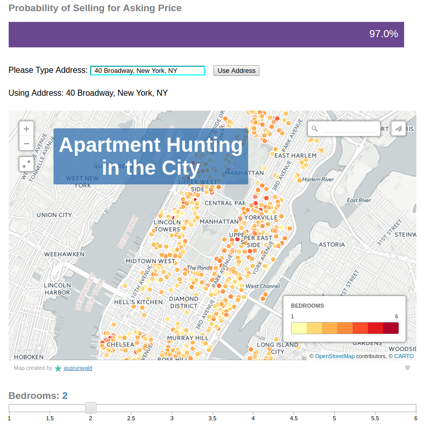

# Apartment Hunting in NYC
 Scraped over 24K apartments in NYC that were sold throughout the past 5 years to determine the probability of an apartment selling at or above asking price.
 
Visit the blog post [here](asgrunwald.github.io/The-Search/).

Play with the Flask application deployed on heroku [here](stark-chamber-51964.herokuapp.com/).

